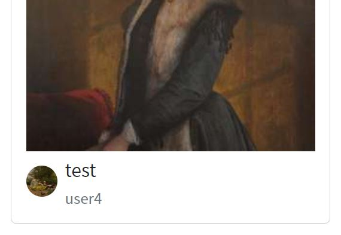
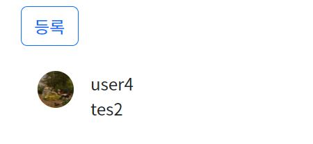

# 1021pair

## 목표

페어 프로그래밍을 통한 영화 리뷰 커뮤니티 서비스를 개발합니다. 아래 조건을 만족해야합니다.

- **CRUD** 구현
- **Staticfiles** 활용 정적 파일(이미지, CSS, JS) 다루기
- Django **Auth** 활용 회원 관리 구현
- Media 활용 동적 파일 다루기
- 모델간 1 : N 관계 매핑 코드 작성 및 활용
  - 유저 - 리뷰
  - 리뷰 - 댓글
  - 유저 - 댓글


## 진행

총 3파트를 나누어 진행하였습니다. 

1. 회원가입(CustomUserCreationForm)
2. 리뷰 쓰기와 댓글 달기(modelForm)
3. 이미지 기능 추가하기

그리고 각자 작업이 끝나면 모여서 같이 꾸미기.


## 나의 역할

저는 회원가입 파트를 맡아서 했습니다. 그리고 추가로 제가 어제 구현 해 놓은 프로필 이미지 기능을 추가 구현하였습니다. 

### 게시판의 작성자 프로필 사진



### 댓글의 유저 프로필 사진



## 내가 작성한 코드

(회원 가입은 많이 해서 생략)


이미지 기능을 팀원이 추가를 해 놓은 상태입니다.

### 프로필 페이지

#### 모델

```python
# accounts/models.py
class Profile(models.Model):
    user = models.ForeignKey(settings.AUTH_USER_MODEL, on_delete=models.CASCADE)
    image = ProcessedImageField(
        blank=True,
        processors=[Thumbnail(200, 300)],
        format="JPEG",
        options={"quality": 50},
    )
```

#### 모델폼

```python
class ProfileForm(forms.ModelForm):
    class Meta:
        model = Profile
        fields = ["image"]
```

#### 생성

프로필 페이지는 하나만 있어야 한다고 생각했습니다. 그래서 생성 페이지를 회원가입할때 가능하게 만들었습니다. 

```python
# accounts/views.py
def signup(request):
    if request.method == "POST":
        form = CustomUserCreationForm(request.POST)
        profile_ = Profile()     # 프로필 생성
        if form.is_valid():
            user = form.save()
            profile_.user = user # 프로필에 유저 추가
            profile_.save()      # 저장
            auth_login(request, user) 
            return redirect("accounts:index")
    else:
        form = CustomUserCreationForm()
    context = {
        "form": form,
    }
    return render(request, "accounts/signup.html", context)
```

#### 사진 업로드 페이지 불러오기 및 업로드하기

```python
def profile_update(request):
    user_ = get_user_model().objects.get(pk=request.user.pk) # 로그인한 유저 정보
    current_user = user_.profile_set.all()[0]                # 그 유저의 프로필 
    if request.method == "POST":
        form = ProfileForm(request.POST, request.FILES, instance=current_user)
        if form.is_valid():
            form.save()
            return redirect("accounts:profile")
    else:
        form = ProfileForm(instance=current_user)
    context = {
        "profile_form": form,
    }
    return render(request, "accounts/profile_update.html", context)
```

#### 불러오기 페이지 html

```html




  <h1>profile-update</h1>
  <form action="" method="POST" enctype="multipart/form-data">
    
    
    <button type="submit" class="btn btn-outline-dark">수정하기</button>
  </form>

```

#### 프로필 사진 보여주기

```html
 <!-- 핵심: review.user.profile_set.all -->

	


```

accounts에 있는 Profile을 reviews/views.py로 가져 올 수가 없었고(그래서 html에서 가지고 왔습니다.), 내가 필요한건 review를 쓴 사람의(user) 프로필이라서 역참조를 사용하여(_set를 활용하여) 해당 값을 가져 왔습니다. 이때 profile의 pk값을 알지 못하지만 profile은 무조건 한개만 만들도록 설정을 하였기 때문에 all을 사용하고 for구문을 사용해 프린트 해 주었습니다. 


### 게시글을 한개 이상 올린 아티스트만 보여주기

저희의 컨셉은 전시회 사이트입니다. 이 생각은 같은 팀원인 오채현님에게서 가져 왔습니다. 처음에는 유튜브 컨셉으로 하려고 했는데. 채현님이 드라이버를 하시면서 명화 사진을 추가 하셨는데. 여기에서 이러면 유튜브를 만들게 아니고 온라인 전시회를 만들자고 생각했습니다. 

그리고 작품을 올린 화가의 목록을 따로 보여 줄 필요가 있다고 느꼈습니다. 관객들은 아티스트의 목록을 중요시 할 거라고 생각했거든요. 

#### views

```python
def index(request):
    users = get_user_model().objects.all()
    artist = []
    for user in users: # 모든 유저
        a = user.review_set.all()
        if len(a) >= 1: # 작품(게시글) 1개 이상 올린 사람만
            artist.append(user)
    context = {
        "artist": artist,
    }
    return render(request, "accounts/index.html", context)
```

#### html

```html



  <h1>아티스트 목록</h1>
  <table class="table">
    <thead>
      <tr>
        <th scope="col">user</th>
        <th scope="col">email</th>
        <th scope="col">last_login</th>
      </tr>
    </thead>
    <tbody>
      
        <tr>
          <th scope="row">
            <a href="">{{ user.username}}</a>
          </th>
          <td>{{ user.email}}</td>
          <td>{{ user.last_login}}</td>
        </tr>
      
    </tbody>
  </table>

```


## 느낌점

처음으로 깃허브를 활용하여 협업을 하는 플레이를 해 보았는데 머지를 할 때마다 잘못 되는건 아닌가 하면서 조마조마한 마음으로 했는데 다행히 사고없이 잘 풀려서 너무 좋았고, 팀원들과 같이 오류를 잡아가면서 나아가는 것이 좋았습니다. 동시에 숨은 고수분을 만나서 와 이때까지 질문 올린거 한번 본 적이 없는데 이렇게 잘 할수가 있나? 약간은 우쭐했던 마음을 다시 다 잡을 수 있는 계기가 되었던거 같습니다. 